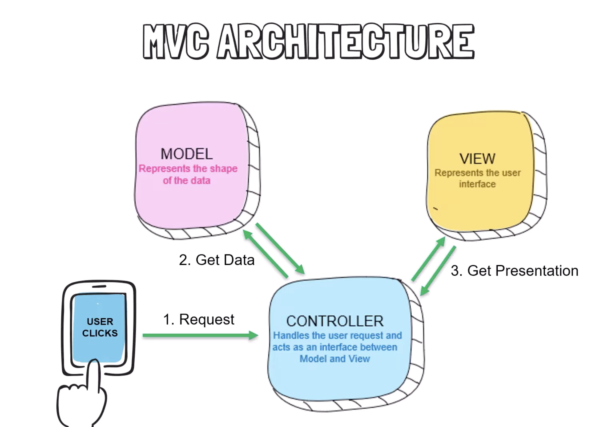
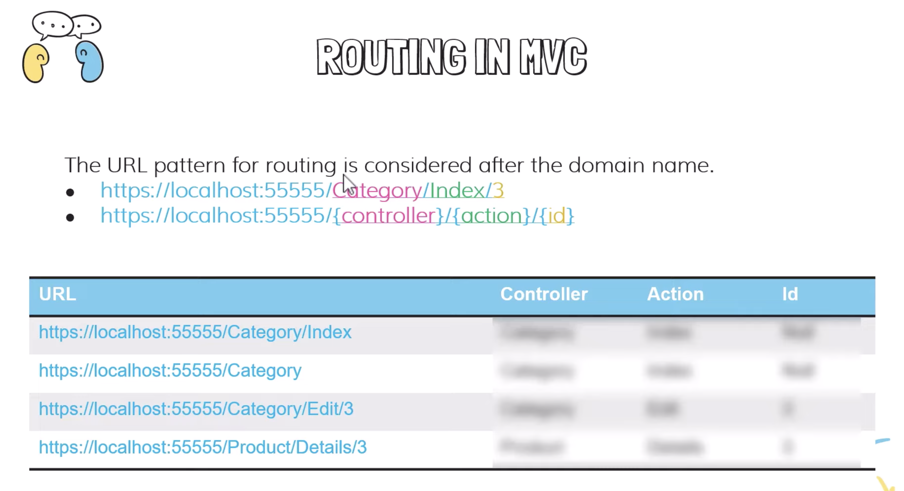

# MVC Workout: 10-Minute Session (Session A) 

## Table of Contents
----

1. [How to create a view using a Controller?](#view)
1. [](#inheritance)




#### 1. Routing in MVC{#Controller}



---
#### 1. What is a Controller Class?{#Controller}

Controller is a class(type) that has been defined in the ASN.NET MVC Framework. It consists of a list of helpful fuinctions that are widely used in the application.

Whenever we create a *** MVC Controller *** it implicitly inherits from the Controller class. This is visible as,  
> public class AdminController : Controller


The top 5 most used are:
Ex: An Admin controller. 
Basic Setup:
Step 1. Add a Controller called *** Admin ***.
Step 2. Create a folder called Admin in Views.
Step 3. Add Index.cshtml and add some html. 

1. View()

It looks for the view using the class name Admin(looks for folder admin inside View folder), then Looks for File called Index.html
```csharp
    public class AdminController : Controller
    {
        public IActionResult Index()
        {
            return View();
        }
    }
```

2. RedirectToAction(action, controller)

Finds the Home controller and executes the Index Function
```csharp
  public IActionResult SendToHome()
        {
            // Code logic
            return RedirectToAction("Index", "Home");
        }
```
We can use this in out view as such: 
```html
<li><a asp-conroller="Admin" asp-action="SendToHome" title="about Roux Academy">Back to home</a></li>
```


1. View()
```csharp

```

1. View()
```csharp

```

1. View()
```csharp

```


---
#### 2. How to create a view using a Controller??{#view}

Cool. Let us make a small feature. 

,

If controller has,
```
public class AdminController : Controller
    {
        public IActionResult Index()
        {
            return View();
        }
    }
```

Page url is now: /Admin


