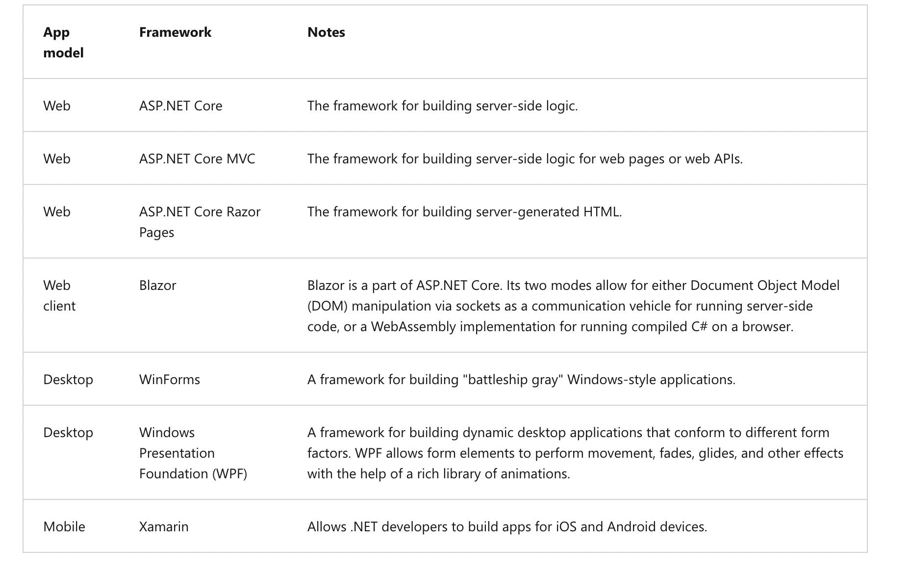

# C# Introduction 

C# is a high-level, object-oriented programming language developed by Microsoft as part of the .NET framework. It is widely used for developing a variety of applications, including desktop software, web applications, mobile apps, and games. It is a popular choice for developing Windows applications, as well as cross-platform applications using the .NET Core framework.

Compiler: The compiler primarily converts your code into an executable format that the computer can understand.


## What is .NET? 
.NET is an echosystem for Application development. Developer write the code mainly in C# Prgramming in this echosystem. 

Once the code is written, the code must be complied. .NET compiler is a program that converts the source code into a special language called intermediate language (IL) this is then saved into a file called .NET assembly.  

The .NET runtime is an execution environment for compiled .NET assembly. The .NET runtime is what executes and manages your application as it runs on a host operating system.

Different frameworks associated are:




## Getting Started 
A most simple C# program that consoles an output;

```C#
using System;

public class Program
{
  public static void Main()
  {
    Console.WriteLine("Hello world!");
  }
}
```


## Data Types

```C#
int myNum = 5;               // Integer (whole number)
double myDoubleNum = 5.99D;  // Floating point number
char myLetter = 'D';         // Character
bool myBool = true;          // Boolean
string myText = "Hello";     // String
```