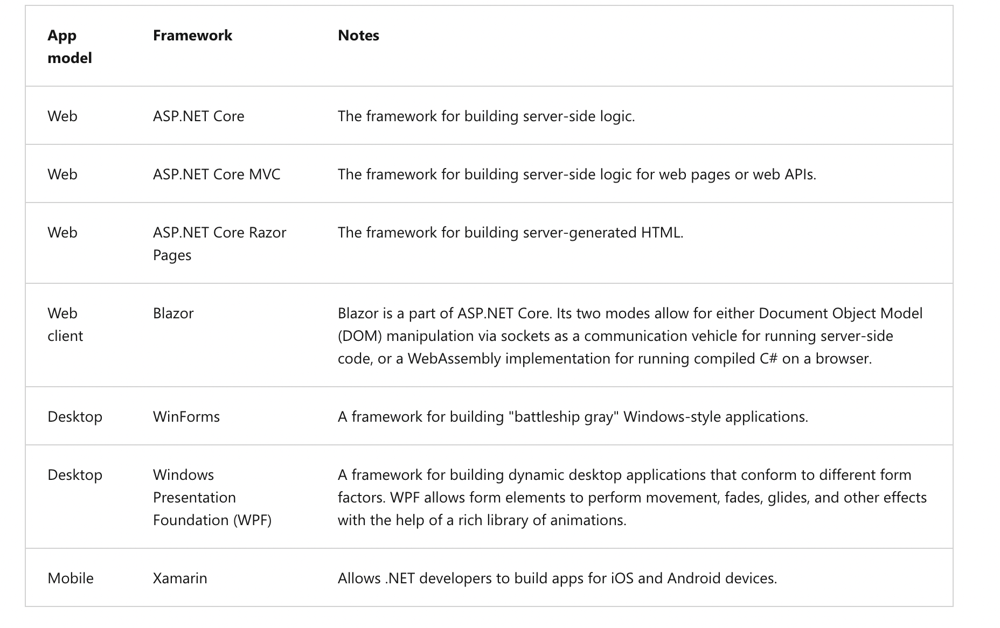

# .NET Project Initialization

* Initialize .NET projects.
* Add packages to and remove packages from a .NET project.
* Manage your package dependencies and update them in a predictable way.


Create a sample .NET project

```.NET CLI
dotnet new console -f net6.0
```

Package management. Similar to node js, packages are installed using:
```.NET CLI
dotnet add package Humanizer --version 2.7.9
```

And it can be seen in the following file:


