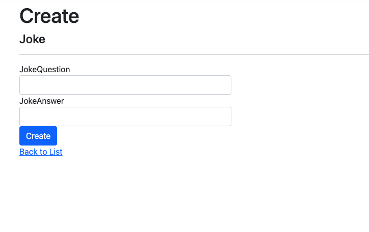

## Jokes Generator

*** Recap MVC Pattern: ***
* Model = classes (objects)
* View  = webpage (Razor HTML)
* Controller = Connects models business logic & web pages

In this program


## View using Rzaor CS
Technologies: ASP.NET, C#, Razor pages, Entity ORM
## Steps

1. Create a new Project in Visual Studioa code and select ASP.NET Core MVC Application
2. Creating a Model class. 
Right click on Models and create a model class. Then add a the model .i.e. basic structure if db for this model.

```csharp
using System;
namespace JokesWebApp.Models
{
	public class Joke
	{
		public int Id{get;set;}
        public string JokeQuestion{ get; set; }
        public string JokeAnswer{ get; set; }

        public Joke()
        {

        }
    }
}

```
3. After add a controller to the Model. Right Clock Controllers, select Add scaffoliding, ASP.NET Core MVC with Razor. Select the Model u just bukild and select ApplicationDbContext.cs 

You will notice that several new pages is added to website. 

In short, 
Create Modal Class, Add Class varaibles, Create a Controller Class for that Model.
Result New Views gets added too. 


4. Lets view our view now.
Oh no the view cannot functon properly, as we dont have a db setup yet. This is another critical stage. 


5. *** Migrations ***
Let us create our first migraton. 
```terminal
dotnet ef migrations add InitialMigration
```
then,
```terminal
dotnet ef database update
```

Now we have the ORM setup for db queries. Object Relation Mapper is arepresentation modal of db,
it looks something like,


Some Features of ORM are:
* ENTITY Framework is basically Microsofts ORM.
* db is updated using migrations
* Simple for basic apps


6. Now since the ORM has created the table.
We have our model , controller & view. Lets checkout the view by going to.
url/Jokes

WOOO, 

There is an interactive application already. And the great part is that it has a CRUD functionality.

