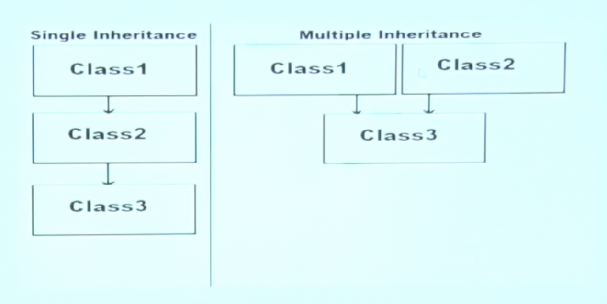

# C# Workout: 10-Minute Session (Session B) 

## Table of Contents
----

1. [Explain the five pillars of Object-Oriented Programming (OOP)?](#oop)
1. [How is Inheritance implemented in C#?](#inheritance)
1. [What is the Parent class of all the classes?](#object)
1. [What are different types of Inheritance?](#typesofinheritance)
1. [Give an example of collowing relation Class A > Class B > Class C inheritance?](#example)
1. [How is a parameterized constructor handled during inheritance?](#parameterized)


----

#### 1. Explain the five pillars of Object-Oriented Programming (OOP)? {#oop}
Let us take a reference from human brain to learn the basic mechanism, 
1. **Encapsulation:** The neurons and synapses within the brain are encapsulated, allowing them to function independently and protect the delicate neural connections.

2. **Inheritance:** Genetic traits related to brain structure, such as certain cognitive abilities, can be inherited from parents to their children.

3. **Polymorphism:** The brain can process different types of information, such as visual, auditory, and tactile, using the same cognitive processes but adapting to different stimuli.

4. **Abstraction:** The brain abstracts complex concepts and experiences, allowing us to think in higher-level concepts rather than dealing with every minute detail.

5. **Association:** The brain forms associations between different ideas and memories, allowing us to make connections and recall information when needed.


---
#### 2. How is Inheritance implemented in OOP?{#inheritance}
Tags: DRY 

Inhertiance is a mechanism of comsuming members of one class in another by establishing parent-child relationship. By doing so all the members of Child class has access to the parent class. *** Reusability ***

- Parent => Parent, Base or Super
- Child  => Derived

Child class can consume the member of Parent class as if it is the owner of the class, 
except *** private *** members of the parents.

```csharp
using System;
namespace IntroCS
{
	public class Parent
	{
        public Parent() {
            Console.WriteLine("Parent Constructor");
        }
		public void Test1() {
			Console.WriteLine("Method 1");
		}
        private void Test2()
        {
			Console.WriteLine("Method 2");
        }
    }
}

namespace IntroCS
{
    public class Child : Parent
    {
        public Child() {
            Console.WriteLine("Child Constructor");
        }
        public void Test3() {
            Console.WriteLine("Method 3");
        }
        static void Main() {
            Child one = new Child();
            one.Test1();
            Console.WriteLine(one.)
            //one.Test2(); //no access
            one.Test3();
        }
    }
}

```
> *** Note: Sequence of calling the function: One calls Parent.Test1(). Child can treat the menmers of their parents but the method still does belong to parents.***

Constructors:
* Both classes get implicit constructor at this example. 
* Parent class constructor must be accesible to child class otherwise inheritance is not possible

---
#### 3. What is the Parent class of all the classes?**{#object}


Every class this is defined by us  or pre-defined in the library has a default parent clas .i.e *** Object *** class which is of System namespace. 
(Equals, GetHashCode, GetType, ToString) are the methods which all the other classes inherit from the object class and is accesible from anywhere.

---
#### 4. What are different types of Inheritance?**{#typesofinheritance}
To simply remember, there are ony two types:
1. Single: 1 immediate parent class
2. Multiple: more than one immediate parent class. (This is not supported in C#)



---

#### Give an example of collowing relation Class A > Class B > Class C inheritance? {#example}


```csharp
using System;
using static IntroCS.Program;

namespace IntroCS
{
	public class Program {
        static void Main()
        {
            Console.WriteLine("This is Main Method");
            ClassC instance = new ClassC();//calls the constructor until Parent
        }

        public class ClassA
	    {
		    public ClassA()
		    {
			    Console.WriteLine("Class A constructor");
		    }
	    }
    public class ClassB:ClassA
        {
		    public ClassB() {  
                  Console.WriteLine("Class B constructor");
            }
        }

    public class ClassC : ClassB
        {
        public ClassC()
            {
                Console.WriteLine("Class B constructor");
            }
        }
    }
}


```
---
#### How is a parameterized parent constructor handled during inheritance?{#parameterized}

We have to explicitly call it using the "base" class,

using System;
using static IntroCS.Program;

namespace IntroCS
{
	public class Program {
        static void Main()
        {
            Console.WriteLine("This is Main Method");
            ClassB instance = new ClassB();
            ClassC instanceTwo = new ClassC();
            instance.display();
            instanceTwo.display();
        }

        public class ClassA
        {
            int x;
            public ClassA(int x)
            {
                this.x = x;
            }
            public void display()
            {
                Console.WriteLine("Class A constructor value is:" + x);
            }
        }
    public class ClassB:ClassA
        {   
		    public ClassB():base(19) {
                  Console.WriteLine("Class B constructor");
            }

        }
    public class ClassC : ClassA
        {
        public ClassC():base(21)
            {
                Console.WriteLine("Class C constructor");
            }
        }
    }
}
```
---


##### See also
