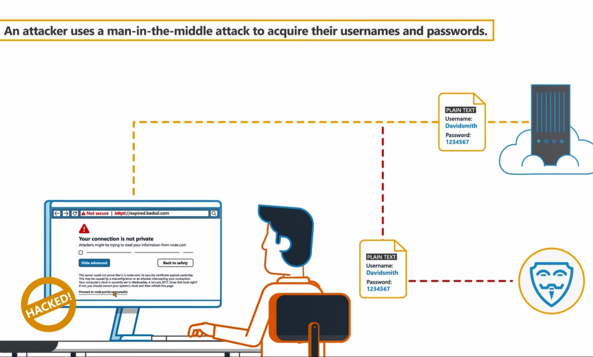

## Sensitive Data Protection

#Applicaiton Security Weakness/Web Vunerability/Sensitive Data Protection

## Insufficient Transport Layer Protection 
The unprotected transport of credentials occur whene an appl;icaiton doensot take sfficient measures to protect network commumnucations.

If the creds is sent not ussing **https protocol, 

To prevent unprotected, follow folowing measures:
1. Use strong protocols for TLS
2. Protect session token with vaildcertificate 
3. Do not allow sensitive data to be subnitted without a scure channel in place. 
