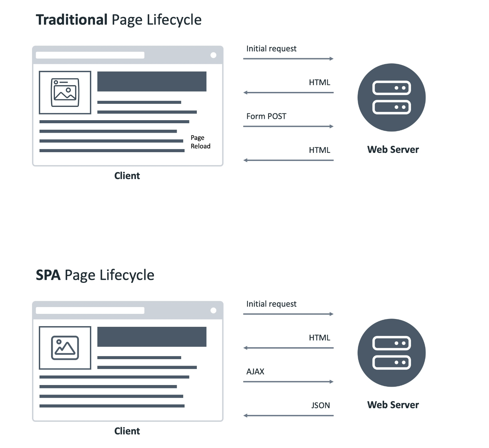

# Navigation
Navigation in websites and web applications refers to the process of moving between different pages or sections within an application. Navigation is a crucial part of user experience and can greatly affect how users interact with an application.

There are several different types of navigation that can be used in websites and web applications, including:

* Global navigation: This refers to the main navigation menu that is present on every page of the website or application. Global navigation typically includes links to the most important sections of the application, such as the home page, product or service pages, about us, contact, and login or sign up pages.

* Local navigation: This refers to the navigation menu that is specific to a particular section or page within the application. Local navigation can include links to related pages or sub-sections, as well as filters or sorting options for displaying specific content.

* Breadcrumbs: Breadcrumbs are a type of navigation that show users the path they have taken to get to the current page. Breadcrumbs can help users navigate back to previous pages and can also provide context for the current page.

* Search: Search functionality can be used as a form of navigation by allowing users to quickly find specific content within the application. Search can be particularly useful in applications with a large amount of content or data.

# SPA Navigation, React Navigation
React is a JavaScript library that helps build user interfaces, and it offers a different approach to handling page navigation compared to traditional HTML pages. In React, navigation is handled through the manipulation of the virtual DOM, which allows for faster and more efficient updates to the UI.

React's single-page application (SPA) architecture means that the entire application is loaded as a single page, and the content is dynamically updated as the user interacts with the app. This approach offers several benefits, including faster load times, smoother user experience, and easier code maintenance.

Additionally, React offers a component-based architecture that promotes code reusability and modularity. This allows developers to create complex UIs by breaking them down into smaller, reusable components, making it easier to manage and maintain the codebase.

Overall, React's approach to handling navigation and building UIs offers a more modern and efficient way to create web applications, and it has become increasingly popular among developers in recent years.

