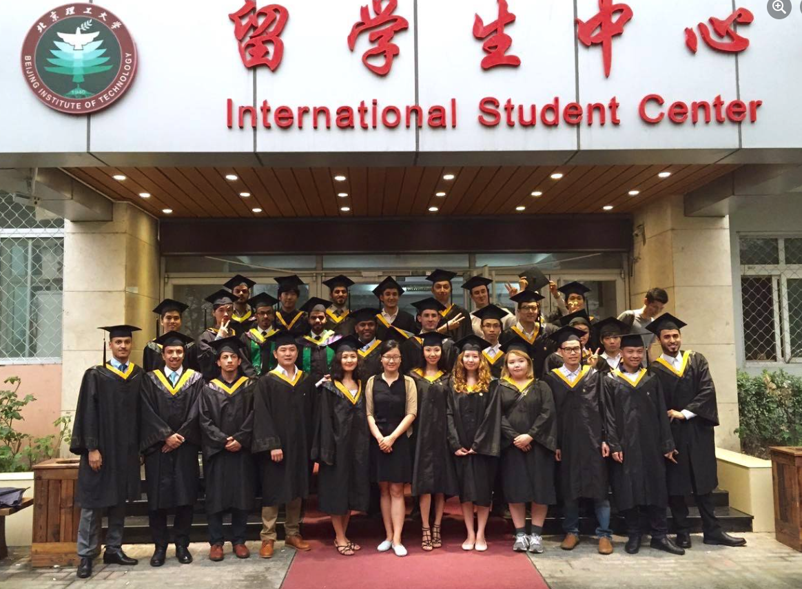
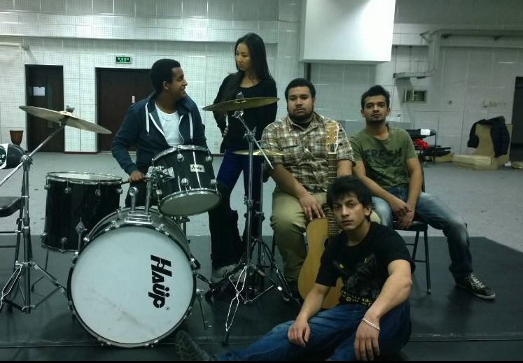

# Intro

Hello! My name is Niyam Bhat and I am a Software Engineer/Web Developer with 2+ years of work experience. I have a strong track record of building high-quality, performant, responsive, and complex web sites and web applications utilizing the best coding practices and web development standards. My skill set includes a solid understanding of web design & development, CMS, object-oriented programming, database, DOM, UI/UX, Automated Tests, Full-Stack Web Development, and relevant concepts.

## What got me into Programming?
In 2011, I began my studies in Electronics Engineering at a university in Beijing. During that time, I became acquainted with a friend from the USA who was passionate about website development using platforms such as Joomla and Drupal. Despite their efforts to share many tutorial videos with me, I was not initially interested. 

However, while traveling later on a trip from Beijing to Harbin to visit my girlfriend, I found myself with just a laptop and a piece of paper, and ended up stumbling upon an outdated tutorial that taught me how to code in Notepad. Despite feeling overwhelmed by the amount of information I had to remember, I persisted and managed to write an HTML script on paper to commit it to memory. Although I wouldn't recommend this method, it has become a habit of mine to always carry a piece of paper or a screenshot of programming-related content whenever I have the opportunity to learn.

High Speed Train from Beijing to Harbin 

Me Graduating with my batch mates in 2015 (Me, Bottom 3rd Left)

My band in the University

## About me

I'm all about exploring the world, learning new things, and meeting new people. I have a serious passion for learning new languages, programming, and building websites. It's super exciting to constantly learn new things and then use that knowledge to create something cool.

When I'm not studying or working on a new project, I love to kick a soccer ball around, take photos, and jam out to my favorite bands like ACDC, GNR, and Dream Theater. I also enjoy trekking, hitting the gym, and spending time with animals.

I have a great sense of humor and I love making new friends. My friends often describe me as outgoing, friendly, and intelligent. I'm always happy to meet new people and gain new perspectives. With my love for adventure and learning, the world is my playground and I'm excited to see what's out there!

## About this Docuseris

In my docuseries, I share my passion for programming and my personal collection of knowledge on programming syntax, languages, tricks, optimization, and architecture. Each episode dives deep into a specific topic, providing an in-depth exploration of my experience and expertise.

As a programmer myself, I know how challenging it can be to keep up with the ever-evolving world of programming. That's why I'm excited to share my insights and tips with fellow programmers, whether they're beginners or experienced developers.

Throughout the series, I cover a wide range of topics, from mastering the basics of programming languages to implementing advanced optimization techniques. I share my personal tricks and strategies that I have learned throughout my experience in programming, and how I have used them to improve my skills and productivity.

I hope that my docuseries can inspire and motivate fellow programmers to take their skills to the next level. So, whether you're a coding newbie or a seasoned developer, come join me on this journey of learning and growth in the programming world!

