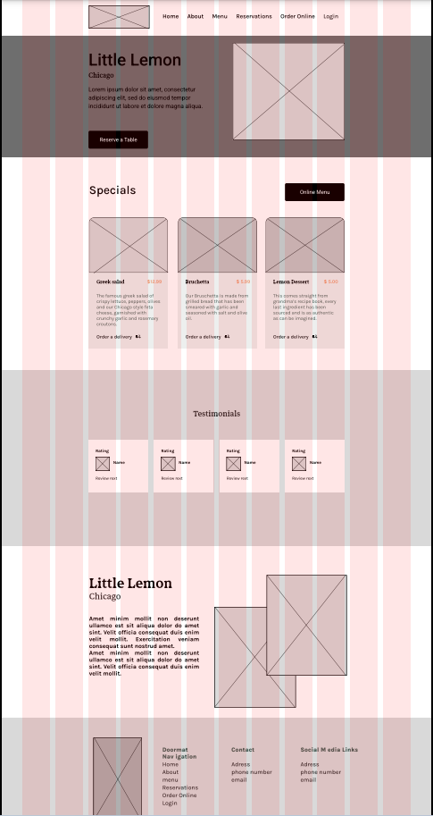
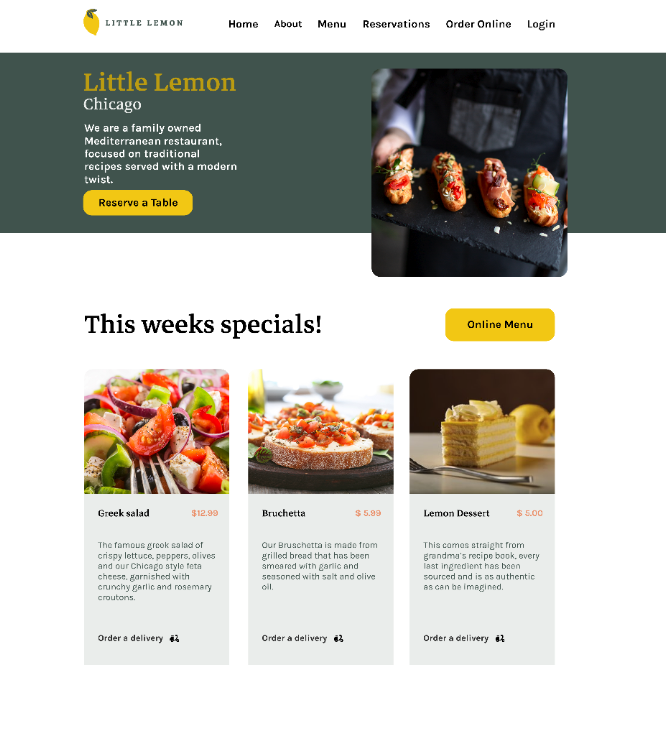
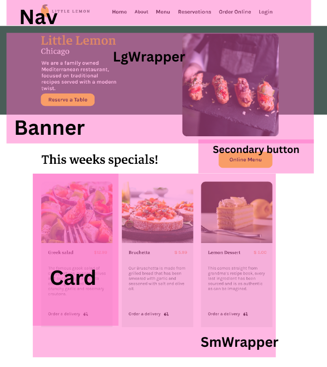

# Lets Get started

# Set up Code Environment

Instructions:install VS Code then, 
1. Setup the ES7+ React/Redux/GraphQL/React-Native VS Code extension
2. Setup the Auto Rename Tag VS Code extension
3. Setup the Trailing Spaces VS Code extension

## Building the Layout

### Wireframing
Wireframing is a visual blueprint of a design that outlines the layout and structure of a digital product before detailed design and development. It helps in testing design concepts and identifying usability issues.

### UI Design:
The UI design phase involves the creation of the user interface by a UI designer. It is important to obtain the design if it has already been produced, otherwise, it needs to be built from scratch.

### Planning Components:
During this phase, our focus is on planning the components. We make an effort to identify recurring and reusable elements such as wrappers, buttons, etc., in order to construct the layout effectively.

TBC ..
https://little-lemons-resturant.vercel.app/reservations