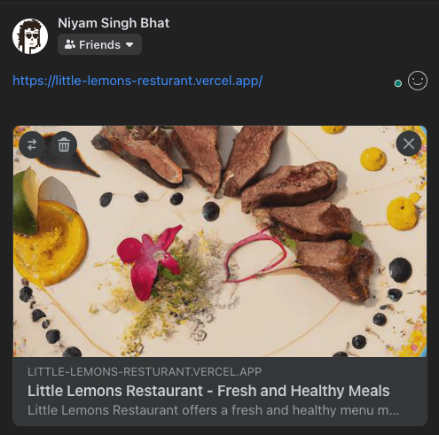

## Tech Specs

Several important considerations and best practices have been applied throughout the development of this project. These include:

1. **Semantic HTML**: HTML that uses semantic markup to provide meaning and context to the content on the page, improving accessibility and SEO.
Example:
```HTML
<div>    
  <ul>
    <li><a href="/home">Homepage</a></li>        
    <li><a href="/about">About Us</a></li>
    <li><a href="/blog">Blog</a></li>  
  </ul>
</div>
```
is replaced with,
```HTML
<nav>    
  <ul>
    <li><a href="/home">Homepage</a></li>        
    <li><a href="/about">About Us</a></li>
    <li><a href="/blog">Blog</a></li>  
  </ul>
</nav>
```

2. **Grid CSS**: The project incorporates a modern CSS layout system that enables effortless creation of responsive grid-based layouts. It also implements a meta standard layout, which adheres to widely accepted design conventions, enhancing the overall usability and ensuring smooth navigation for users on the website.Additionally, the project makes use of the Open Graph Protocol (OGP). OGP is a set of metadata tags that enhance the presentation of web pages when shared on social media platforms. By implementing OGP, the project ensures that shared links provide accurate and visually appealing previews, maximizing engagement and improving the user experience when sharing content on social media.

```HTML
<meta name="description" content="Welcome to Little Lemons restaurant, where we serve delicious and healthy meals made with fresh ingredients. Visit us today for breakfast, lunch, or dinner and experience our friendly service and cozy atmosphere." />
<meta name="og:title" content="Little Lemons Restaurant - Fresh and Healthy Meals" />
<meta name="og:description" content="Little Lemons Restaurant offers a fresh and healthy menu made with locally sourced ingredients. Our dishes are bursting with flavor and nutrition, and our friendly staff will make you feel right at home. Come and join us for a truly delicious experience." />
<meta name="og:image" content="https://example.com/little-lemons-restaurant.jpg" />

```



Open Graph Protocol has been used to adapt to meta. 

3. **Accessibility**: Techniques and technologies used to ensure that the website is accessible to all users, including those with disabilities.The project has employed various techniques and technologies to ensure that the website is accessible to all users, including those with disabilities. This commitment to accessibility is essential for creating an inclusive online experience. Some of the approaches used include:
* Keyboard Navigation: The website has been designed to be fully navigable using keyboard inputs alone. This enables users who rely on keyboard navigation or assistive devices, such as screen readers, to access and interact with all functionalities.
* Alt Text for Images: All images used in the project have appropriate alternative text (alt text) assigned to them. Alt text provides a textual description of the image content, allowing visually impaired users to understand the context and meaning conveyed by the images.
* Color Contrast: The project adheres to WCAG (Web Content Accessibility Guidelines) guidelines for color contrast. Sufficient color contrast between foreground and background elements ensures that the content remains readable for individuals with visual impairments.
* Accessible Forms: The forms on the website have been designed with accessibility in mind. This includes proper labeling of form fields, clear instructions, and providing error messages in a way that is perceivable and understandable by all users.
* Screen Reader Compatibility: The project has been tested for compatibility with popular screen readers, ensuring that users relying on screen readers can effectively access and consume the website's content.
* Aria Roles and Attributes: ARIA (Accessible Rich Internet Applications) roles and attributes have been appropriately implemented to enhance the accessibility of dynamic or interactive elements. These provide additional information and context to assistive technologies.

By employing these techniques and technologies, the project aims to provide equal access and usability for all users, regardless of their abilities or disabilities.

4. **UI/UX usability**: The project places a strong emphasis on UI/UX usability, prioritizing the design of interfaces that are intuitive, user-friendly, and deliver a positive user experience.


GIT: A version control system used to manage and track changes to the codebase.
JSX: A syntax extension for JavaScript that allows for the creation of React components.
JS: JavaScript, a programming language used to create dynamic and interactive web pages.
Version control: The use of a system, such as GIT, to track and manage changes to the codebase over time.